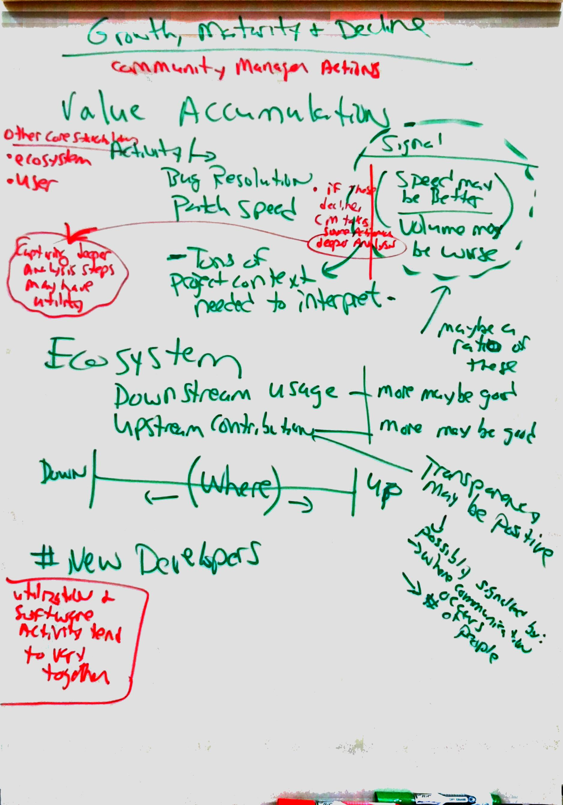

# Metric: Growth-Maturity-Decline

## Issue Resolution
 Activity Metric | Description
 --- | ---
 Open issues | Total number of open issues.
 Closed issues | Total number of closed issues.
 Resolution efficiency | Number of closed issues / number of abandoned issues.
 Average & median time of open issues | The average & median amount of time issues remain open.
 Average & median time of first response | The average & median amount of time until the first response to an issue is made.
 Histogram of open issue time | The distribution of time issues have remained open.
 Histogram of issue resolution time | The distribution of time it takes for issues to be resolved. 

## Code Development
 Activity Metric | Description
 --- | ---
 Number of commits | Total number of commits.
 Number of lines changed | Total number of lines of code that have been changed.
 Average & median time to merge code | The average & median amount of time it takes to get code merged upstream. 
 Histogram of time to merge | The distribution of time it takes for code to be merged upstream.
 Review efficiency | Number of merged patches / number of abandoned patches.

## Project Communication
 Activity Metric | Description
 --- | ---
 Total communications | Total number of posts made to communication platforms.
 Average & median communication response time | The average & median time taken for communications to be responded to.
 Average & median communication responses per thread | The average & median number of responses that are made to each communication thread or topic.
 Histogram of communication responses per thread | The distribution of the number of responses made to each communication thread or topic.

**Background:**
At the Open Source Summit North America, a group of around 8-12 people each agreed on the metrics important in the following scenarios.
For now, we will focus our conversation around these outcomes to further the conversation.
The two-hour session sparked great conversations but could not address all aspects.
We thank everyone who participated.

Below is the metric->signal->action chain for *Growth-Maturity-Decline*.

**How to contribute:**
- To advance the document, fork the rep, make your changes, create a pull request see CONTRIBUTING.md
- To ask questions or make comments, post to our [mailing list][ml], join our weekly [Hangout call][ho], or open an [issue on GitHub][issue].

[ml]: https://wiki.linuxfoundation.org/chaoss/metrics#mail-list
[ho]: https://wiki.linuxfoundation.org/chaoss/metrics#weekly-hangout
[issue]: https://github.com/chaoss/metrics/issues

## Growth-Maturity-Decline: Metric -> Signal -> Action

### Value Accumulation
- Patch speed: There can be two different data.  One is "review efficiency", which is the number of merged/abandoned changes out of all submitted patches over a given period.  The other is "time-to-merge", which is the time since a patch is submitted until this is merged/abandoned.
- Bug resolution: Somewhat similar to the patch speed above.  We could look at the total number of tickets closed out of all the tickets opened over a given time period.  We can also look at the "time-to-close", which is time since a bug is opened until it is closed.
- *Why:*
    - We want to know how active a project is and whether new contributions are being accepted in a timely fashion.
- *Signals:*
    - Higher velocity signals regular/on-going activities in the community 
- *Informs activity:*
    - (not discussed at OSSNA)
- *Potential positive or negative outcomes:*
    - (not discussed at OSSNA)

### Community Growth
- Number of new developers: Number of new contributors (using appropriate userid) over a period (e.g. monthly, quarterly, etc.)
- *Why:*
    - Growth can be measured in new developers.
- *Signals:*
    - More newcomers signal on-going interest/awareness in the project and the community.  
- *Informs activity:*
    - (not discussed at OSSNA)
- *Potential positive or negative outcomes:*
    - (not discussed at OSSNA)

### Usage
- Trajectory of usage (e.g. OpenSSL high usage was not indicative) - time over time activity.
- Project dependency - ecosystem position: where is the project on the continuum between mostly used downstream or mostly dependent on upstream? - that determines how the other metrics are interpreted.
- *Why:*
    - We have to understand contextual factors to understand the other metrics and signals.
    - Let's us compare a project over time.
- *Signals:*
    - Transparency
    - More usage (upstream and downstream) might be good
    - Upstream contribution may be good
    - Downstream usage may be good
    - Transparency may be positive - possibly signaled by
        - Where communication occurs
        - # of people
- *Informs activity:*
    - (not discussed at OSSNA)
- *Potential positive or negative outcomes:*
    - (not discussed at OSSNA)

## Images from workshop
We thank everyone who participated in the workshop at the Open Source Summit North America. The below picture is the flip chart figure that came out of the Growth-Maturity-Decline group.

